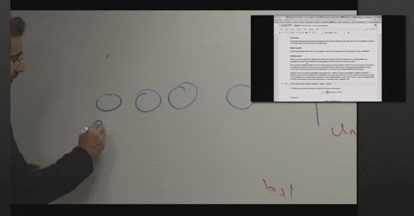
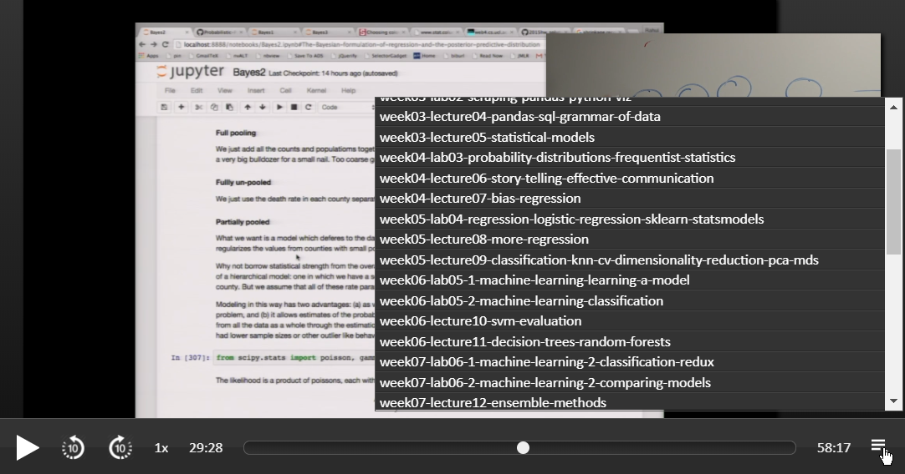

# cs109-duo-video-player
Single responsive HTML to play two videos in sync side by side ( or any other videos by modifying the code ). 
Built for watching Harvard CS109 course locally.

## Familiar interface with some added functionalities.
- Hide Secondary player window temporarily | Change Secondary player window's position

- Switch Main and Secondary player window

- Playlist | Fast forward / backward | Playback speed control

## Usage
1. Use this script from [christopher-beckham](https://github.com/christopher-beckham/cs109-dl-videos), and merge [pull request 11](https://github.com/christopher-beckham/cs109-dl-videos/pull/11) to download course videos into `Videos` directory. 
2. Save `Player.html` in the same directory, then open with browser.

